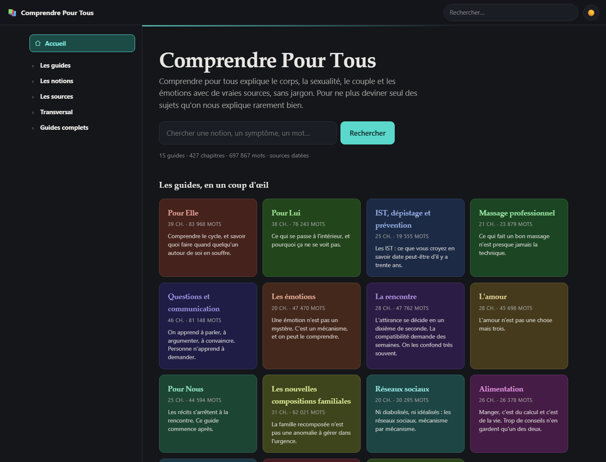
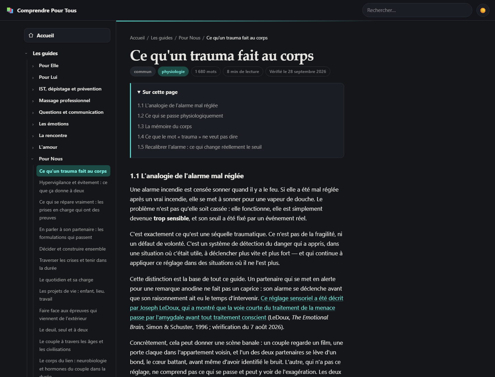
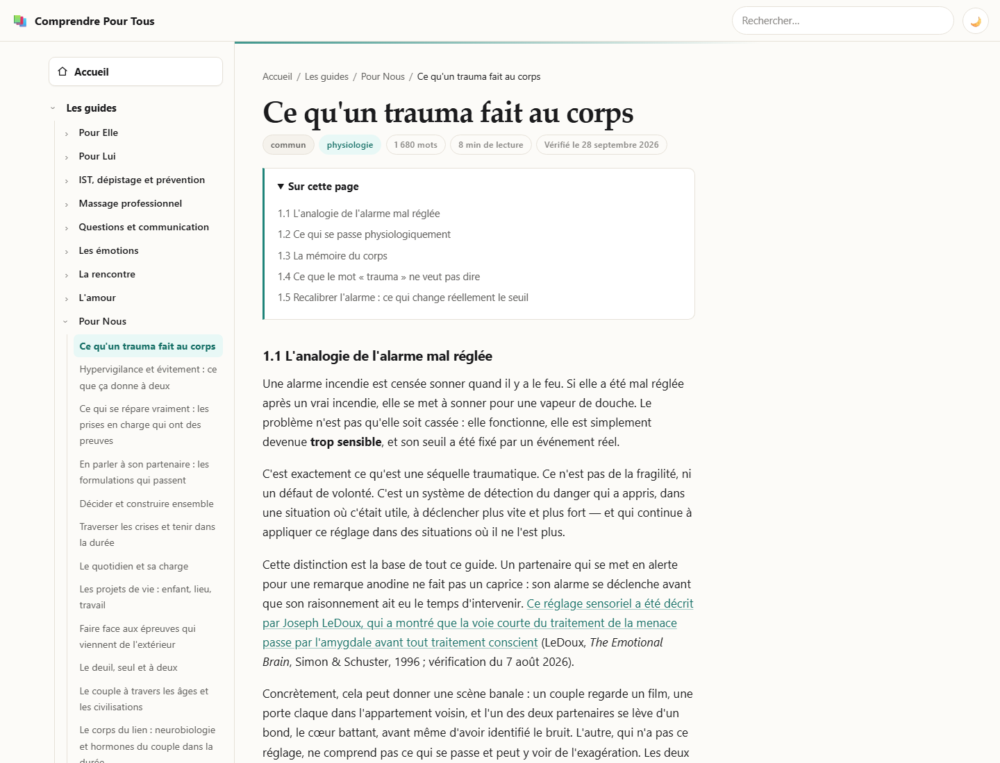
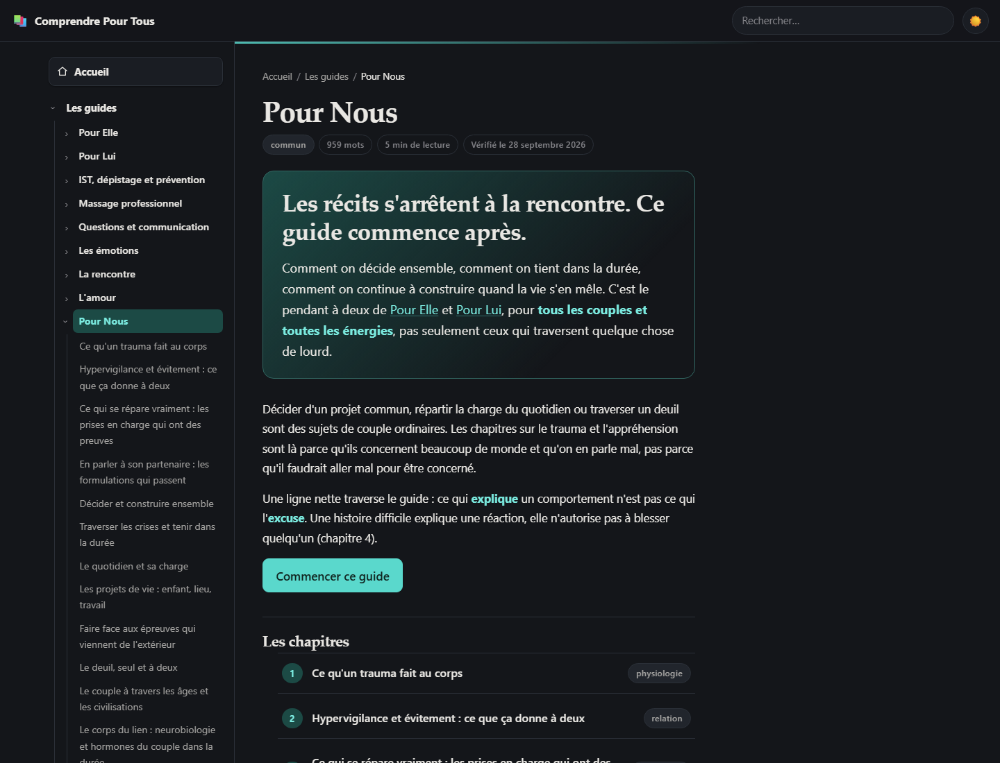
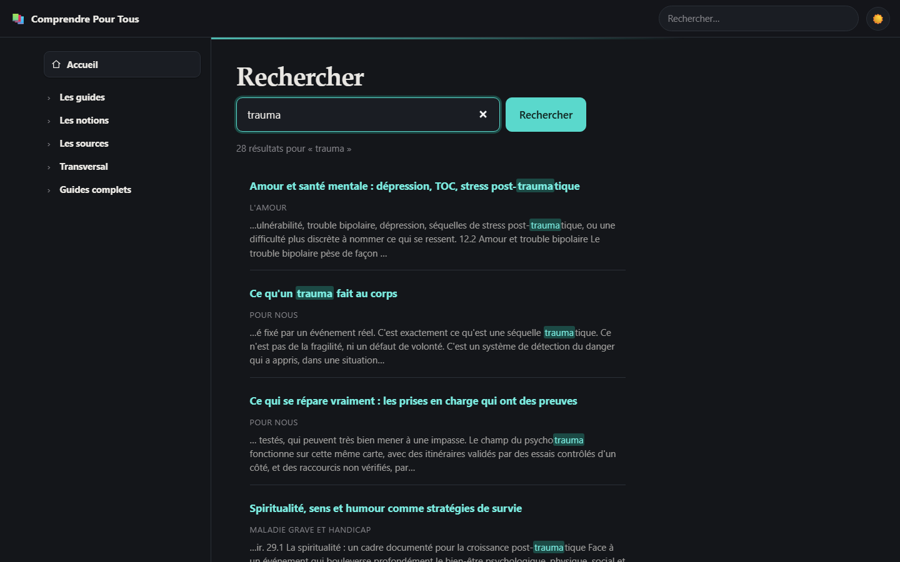
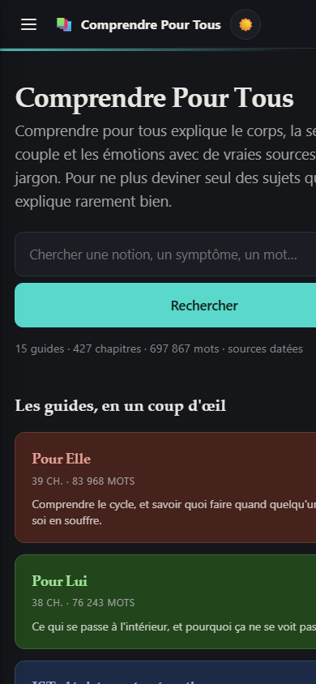
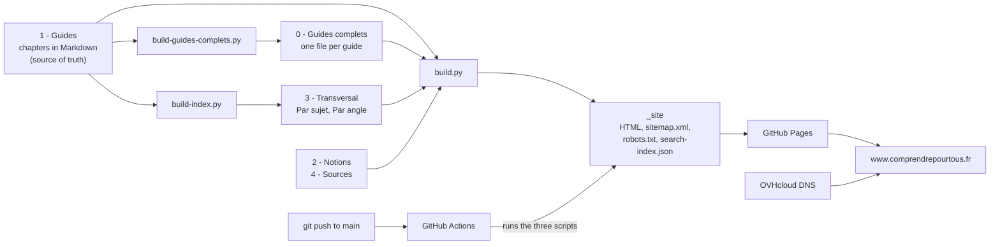
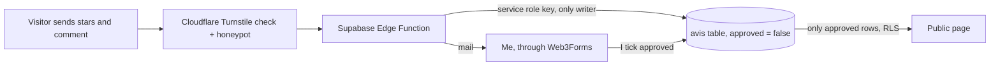

# Comprendre pour tous (Understand For Everyone)

> **A free, open and sourced website that explains the body, the emotions and the relationship "for real". 15 guides, 427 chapters, about 263,000 words, published at www.comprendrepourtous.fr. The text and the code are public.**

- **Site:** https://www.comprendrepourtous.fr
- **Repository:** https://github.com/Jordan1618/ComprendrePourTous
- **Language of the site:** French. Only this documentation is in English.
- **Numbers (from the repository):** 212 commits between 2 August and 1 October 2026, 635 generated pages, 4 Claude skills.



---

## Vision & Purposes

People hear many words (endometriosis, male depression, HPV, post-partum) and think they understand them, with a vague idea. That is never enough on the day it concerns someone close. My goal is educational: mechanisms explained instead of definitions, figures that are sourced and dated, and what it changes in a relationship instead of theory.

### Philosophy

- **Every guide is written in both directions.** The guide on the female cycle is for women who want to understand their body and for men who want to understand their partner's. The male emotional health guide does the opposite. Understanding the other's body is the condition to care about it beyond the surface.
- **Honesty about who I am.** I am an IT student, not a doctor, a psychologist or a sexologist, and the site says it. I commit my skills in research and source checking, never a personal medical opinion. Each guide ends with a discreet warning note: general landmarks to understand, not truths to follow at 100%, and a professional for complex situations.
- **Never invent precision.** When a figure is debated, the text gives a range and says it. When a source or a testimony is missing, the text says it is missing. A reference, a URL or a DOI is never made up (see [Sourcing Method](Sourcing%20Method.md)).
- **Nuance everywhere.** No universal statement about couples, families or gender: "in most cases", never a rule that applies everywhere. Real emergencies stay as facts, not as disclaimers: 15 for a medical emergency, 3114 for suicide prevention.
- **Explaining, not quoting.** After my critique of the first long guides ("they only quote studies and never explain them"), every chapter must define its object, explain what the researchers did and why it matters, and follow one thread (see [The Optimized Claude](The%20Optimized%20Claude.md)).

### Public service mission

- **Free, no ads, no tracking.** No cookie, no analytics, no pixel, no sale of data. The privacy page says so, and names the third-party services used.
- **Open license: CC BY 4.0.** Anyone can copy, translate, modify and republish the text, even commercially, if they credit the project. A restrictive license would limit the only thing that matters here: information circulating.
- **Open code ("publicity of the code").** The whole repository is public: the guides in Markdown, the site generator, the deployment workflow, the skills and even the maintainer notes. Anyone can check the sources, report an error through GitHub issues, or reuse the method. Every page links to its source file on GitHub.
- **Public reviews and a correction channel.** Each page has a star rating with moderated comments and an error-report block, so a reader can correct me.
- **An independent reliability report.** The file ANALYSE.md summarizes the corpus for a skeptical reader, and the home page links to it as "Is it reliable?", with the remark that it is one more landmark, not a stamp of authority.

---

## Preview

A chapter, in dark mode and in light mode:





The guide page, the search (28 results for "trauma", with highlighted words) and mobile:







---

## The Technical Core (Tech Stack)

- **Content:** Markdown files with a YAML frontmatter on every chapter (guide, chapter, title, subject, angle, verification date, license). Written and navigated in **Obsidian**.
- **Site generator:** `build.py`, my own static site generator in **pure Python**, standard library only. It reads the Markdown and writes plain HTML in `_site/`, with a sitemap, a robots file and a search index.
- **Front end:** hand-made HTML, CSS and vanilla JavaScript. Each guide has its own color: the CSS derives the light and dark accents from one hue value. Illustrations are inline SVG. Dark mode follows the system and can be switched.
- **Search:** built at build time into a `search-index.json` file (503 entries), queried in the browser, with accent-insensitive matching and highlighted snippets. No server.
- **Structured data and sharing:** JSON-LD (DefinedTerm on notions, Article on chapters, WebSite on the home page) and an Open Graph image, see [SEO and Domain Name](SEO%20and%20Domain%20Name.md).
- **Forms:** contact and error reports go from the browser to **Web3Forms**, a third-party relay that sends a mail. Its access key is not shown in this documentation.
- **Public reviews:** a **Supabase** database (PostgreSQL with row-level security), a **Supabase Edge Function** in TypeScript, and **Cloudflare Turnstile** (a free anti-bot check) plus a honeypot field.
- **Hosting and deployment:** **GitHub Pages**, built by a **GitHub Actions** workflow on every push to `main`.
- **Domain:** `comprendrepourtous.fr` registered at OVHcloud.
- **Writing assistant:** four Claude skills, a `CLAUDE.md` file and a request log (see [The Optimized Claude](The%20Optimized%20Claude.md)).

The home page also shows my own rating of my tools out of 5 stars, "an honest rating, not a business card": Python 4, Markdown 5, HTML/CSS 3, Git/GitHub 4, GitHub Actions 3, OVHcloud 3, JSON-LD 3, Web3Forms 3, Claude 5.

---

## Architecture & Files

```
ComprendrePourTous/
├── 0 - Guides complets/     each guide in one file (generated, never edited by hand)
├── 1 - Guides/              the same guides, one file per chapter (source of truth)
├── 2 - Notions/             short notes per concept, pointing to the chapters
├── 3 - Transversal/         indexes by subject and angle (generated), glossary, warning signs
├── 4 - Sources/             one page of sources per guide, with direct links
├── 5 - Notes Internes/      maintainer notes, audits, worksites, request log (not on the site)
├── assets/                  style.css, app.js, favicon, share image
├── supabase/                database schema and the review Edge Function
├── .claude/skills/          the four skills
├── CLAUDE.md                rules loaded automatically at the start of each Claude Code session
├── MAINTENANCE.md           the long reference of the rules, and the why
├── ANALYSE.md               the independent reliability report
├── build.py, build-index.py, build-guides-complets.py
├── CNAME                    custom domain for GitHub Pages
└── .github/workflows/       build and deploy
```

The build pipeline:



How the reviews work:



Key ideas:
- **One source of truth.** Chapters in `1 - Guides` are edited. `0 - Guides complets`, the indexes and `_site` are generated and overwritten at each build.
- **Two classification axes in the frontmatter, not in folders.** Subject (female body, male body, common) and angle (physiology, psychology, prevention, practice, relationship, references).
- **Reciprocity of sources.** Every link used in a chapter must also appear in `4 - Sources/<guide>.md` with the same direct link, and a script checks it.
- **A page is built from several layers:** full guide to read in one go, chapter to find one point, notion for a quick definition, glossary for a word, warning-signs page for a worrying situation now.
- **Why each file is where it is:** see the table in [The Optimized Claude](The%20Optimized%20Claude.md).

The 15 guides: Pour Elle, Pour Lui, IST (STIs), Massage professionnel, Questions et communication, Les émotions, La rencontre, L'amour, Pour Nous, Les nouvelles compositions familiales, Réseaux sociaux, Alimentation, Le sommeil, Maladie grave et handicap, Psychologie de la personnalité.

---

## Detailed Notes

- [Design, Evolution and Corrections](Design%2C%20Evolution%20and%20Corrections.md): how it was made step by step, from 2 August to 1 October, and everything I fixed
- [The Optimized Claude](The%20Optimized%20Claude.md): the skills, CLAUDE.md, and why each file lives where it lives
- [Sourcing Method](Sourcing%20Method.md): the heart of the project, with real cases of refused sources
- [SEO and Domain Name](SEO%20and%20Domain%20Name.md): what I learned about search ranking and domain names
- Skill doc: [Faiseur2Guide](../../Tools%20%26%20Skills/Skills%20%26%20MasterPrompts/Skills/Faiseur2Guide.md)

---

## Problems Encountered

- **A broken site at the start.** The first Hugo version had a broken CSS because relative URLs produced invalid paths. Then the Pages source served the repository root instead of the build, which broke the site again.
- **HTTPS that would not turn on.** The "Enforce HTTPS" box could not be ticked for days while the DNS and the Pages source were still wrong.
- **Quoting without explaining.** Four guides written in "volume mode" had perfect source links but no explanation. This led to a new method and a full audit (see the evolution note).
- **AI can invent references.** A guessed DOI points to another article and the error is invisible. The rule is: never fabricate a reference, a URL or a DOI.
- **Placeholders left in the sources.** Dozens of source entries pointed to a generic search page instead of the real article, and some links in chapters had no match in the sources folder.
- **Maintainer notes leaking into public pages.** Sections like "Additions of the date" or "What remains to do" were visible to readers. I moved them to an unpublished folder.
- **Silent breakage when adding content.** A guide with nothing pointing to it is online and nobody arrives. I wrote a checklist and scripts to regenerate the indexes.
- **Renaming breaks links.** Renaming a guide changes its URL, so old shared links would give a 404. The generator has a redirect table.
- **The Claude session limit and parallel work.** Mass audits hit a session cap once. I learned to use fewer, wider agents, to do mechanical work with scripts, and to keep a portable follow-up file so another session can resume.
- **Sensitive subjects.** Health, sexuality and mental health need care: sources, ranges instead of fake figures, nuance blocks, and emergency numbers as facts.

---

## Skills Learned

- Building a static site generator from scratch (frontmatter parsing, link resolution, templates, sitemap, search index, redirects)
- Front-end basics: responsive CSS, dark mode, accessibility (labels, breadcrumbs), inline SVG, cache-busting of assets
- CI/CD with GitHub Actions and GitHub Pages
- Git on a real project (212 commits, parallel branches and a merge)
- Information architecture: a source of truth, generated artifacts, two classification axes, cross-references in both directions
- Research discipline: sourcing, dating, ranges, refusing fabricated references
- Prompt and skill engineering: encoding a method so that an AI repeats it, separating writing rules from method, an audit skill in read-only mode
- Working with parallel AI agents: scope, checks before committing, portable follow-up files
- Web security basics: row-level security, an Edge Function as the only writer, an anti-bot check, secrets kept out of the client
- Open licensing (CC BY 4.0) and publishing code publicly
- Privacy by design: no cookie, no tracker, third-party processors named openly (GDPR logic)
- SEO and domain names (see the dedicated note)
- Writing for a general audience on sensitive topics
