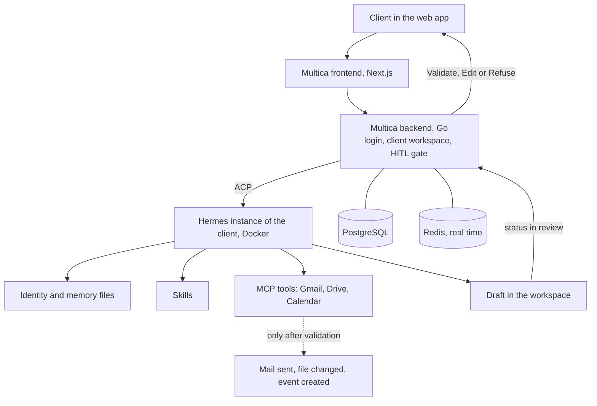

# Polywise - Project Overview

> **Team startup project, the source code stays private. This note only describes the goals, the architecture at a high level, the problems and what I learned. No client names, servers, domains or secrets.**

---

## Goal of the project

Polywise gives small companies (4 to 15 employees) a team of specialized AI assistants called "sages". The client talks to them in a web interface, and they act inside the tools the client already uses (mail, drive, calendar, CRM).

The main rule is **HITL (Human In The Loop)**: a sage prepares an action, but nothing leaves the company (mail sent, file changed, event created) until a human clicks "Validate".

My role is "AI integrator". I work with other people on it and I have three missions, in this order:
- Understand the stack
- Debug when needed
- Write skills (the work methods of the sages) and propose new features

Nb : I did not write code in the shared repository. My work is the understanding, the skills and the written documentation, and that is what this note shows.

---

## The Technical Core (Tech Stack)

The project is two open-source products glued together:

- **The skin: Multica (forked).** A Linear-like task manager where AI agents are teammates. A **fork** is a private copy of an open-source project that we modify. Backend in Go (Chi router, sqlc, WebSocket), frontend in Next.js, monorepo with pnpm and Turborepo, PostgreSQL. The fork is translated to French and rebranded.
- **The brain: Hermes.** An open-source autonomous agent runtime. It is not programmed with code, it is "sculpted" with markdown files that define its identity and rules.
- **The bridge: ACP.** Multica starts Hermes as a subprocess and talks to it through this protocol, then streams the answer to the browser with WebSocket.
- **The tools: MCP (Model Context Protocol).** A standard to plug external tools (Gmail, Drive, Calendar, Notion) into an agent.
- **Infrastructure:** Docker containers on a Linux VPS, Redis for real time, OpenRouter to reach the language models, a Google OAuth service that keeps each client's tokens separated.

---

## Architecture Layout & Data Flow

Each client has their own Hermes container. The backend filters the database by workspace, so one company never sees another one.

How Hermes is configured, from most to least read:
- **Read at every message:** identity file, user profile, company memory. They must stay very short, because every message pays for them in tokens.
- **Read on demand:** skills and extended context. These can be long.

---

## What I Worked On

- **Skills.** A skill is a markdown file that gives the sage a step-by-step method for one precise task (for example "reply to quote requests with a personalized template"). I learned the structure: when to use it, what it produces, the steps, the HITL validation step, the examples, the tools needed.
- **The discovery skill (onboarding).** It asks a new client structured questions, then fills the profile and memory files by itself. It turns hours of manual setup into about twenty minutes.
- **A test routine for every skill:** direct call, correct output location, HITL triggered before any sending, ambiguous request, missing tool.
- **A full understanding guide** of the architecture, written for myself and for new people joining the team.

---

## Problems Encountered

- **"Multi-agent" is a confusing word.** Many products make one model play several roles in the same growing conversation. In Polywise, each client has one Hermes instance, each sage has its own persona, skills and separated workspace, and only one sage is active at a time. Understanding this difference took time and changed how I design skills.
- **Multi-tenant isolation.** Data is separated by workspace in the database, by container for the agent, and by namespace for documents. During the pilot some parts were still shared, which I noted as a known debt.
- **Technical debt found during an audit:** a deployment script that existed only on the server and not in the repository, a security patch that existed only on the server, migration numbers from the fork that would collide with the upstream ones, no monitoring or alerts on scheduled jobs.
- **GDPR.** We are a processor of the client's data. The default language model provider sent data outside the EU, which is blocking before a real client. Other points: a data processing agreement for each client, conversation content that should be reduced to metadata in telemetry, secrets to rotate.
- **A configuration gotcha.** After changing an environment file, containers must be recreated. A simple restart does not reload the variables.

---

## Skills Learned

- Reading and navigating a large Go + Next.js monorepo I did not write
- Agent design: persona files, skills, MCP tools, memory layers, token cost
- Human-in-the-loop as a product rule enforced twice, in the prompt and in the code
- Multi-tenant thinking and Docker isolation
- GDPR reasoning applied to an AI product (processor role, data transfers)
- Auditing technical debt and writing it down clearly
- Working in a small startup team on something real
