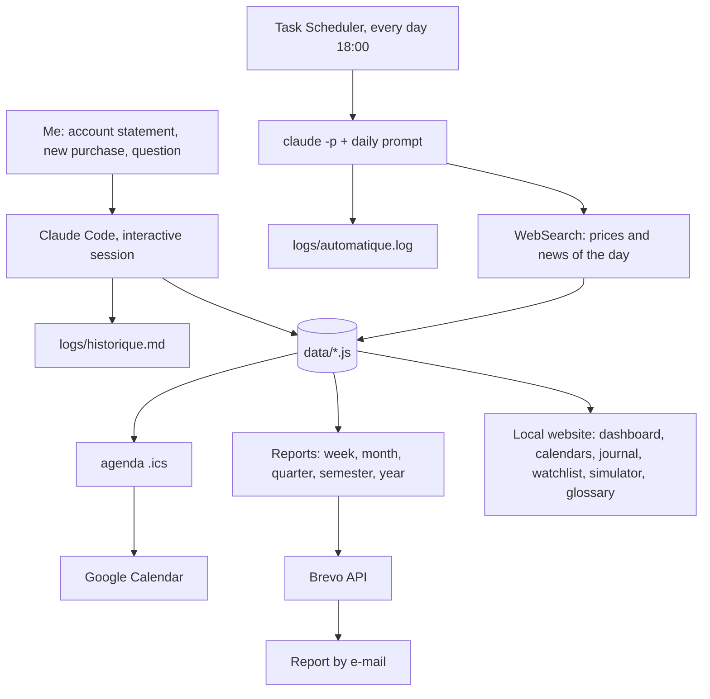

# Projet AG - Project Overview

> **Personal project. All the real data stays private and offline. This note describes the goals, the architecture and what I learned. No amounts, no positions, no account numbers, no contacts, no keys.**

---

## Goal of the project

"AG" means *Assemblée Générale*, the annual shareholders' meeting of a listed company. Owning a single share is enough to attend one.

The project started from two ideas:
- **Learn investing as an amateur** with a PEA (a French tax-advantaged stock account) and a long-term view. The goal is to understand and challenge myself, not to become a financial advisor.
- **Go to AGs, trade fairs and business clubs** in my region to meet people and grow my professional network.

So I built, with Claude Code, a local website that remembers a portfolio, follows the news, lists the events and writes long weekly reports to teach me.

---

## The Technical Core (Tech Stack)

- **Local website:** plain HTML, CSS and JavaScript, opened directly from the disk (`file://`). Dark mode, automatic table of contents, charts. No server, no framework.
- **Data files:** one JavaScript file per topic (`data/*.js`): portfolio, events, decision journal, watchlist, contacts, dividends, report index. They are the single source of truth, every page reads them with a `<script>` tag (no fetch, so it works offline).
- **Claude Code:** the "analyst". A `CLAUDE.md` file holds the permanent rules (sources, vocabulary, editorial charter), and a prompt file describes the daily job.
- **Windows Task Scheduler:** a PowerShell script runs Claude Code in non-interactive mode (`claude -p`) every day at 18:00, after the Paris stock market closes. It wakes the PC, catches up if the PC was off, and waits for the network.
- **Calendar:** a script regenerates an `.ics` file every day (AGs, fairs, results, central banks, dividends), imported into a dedicated Google Calendar.
- **E-mail:** a script sends the reports of the day through the Brevo API. The API key is encrypted with Windows DPAPI, outside the project folder.

---

## Architecture Layout & Data Flow

---

## What the website contains

- **Dashboard:** value, gains and losses, weight of each line, and a "thermometer" that compares today's move with the usual move of the stock. Rule: more than 2x the usual move means I must go and read the news.
- **AG & networking calendar** and **markets calendar** (results, central banks, macro, geopolitics), with place, conditions and registration deadline.
- **Decision journal:** each time I buy something, I give my reason, and Claude adds a strategic review and a score out of 10 on the *process*, not the result.
- **Watchlist, dividend calendar, contact book, "what if" simulator, glossary, to-do list.**
- **Reports:** one every week (8-10 pages, with a different focus each week), then monthly, quarterly, half-yearly and yearly. Each one is written by a "committee" of personae (Mentor, Wealth advisor, Analyst with a plain-language "Translation", Reporter, Network coach, Value investor, Devil's advocate, Geopolitician), and ends with a quiz and open questions.
- **Shareable report:** an anonymous version for social networks, built on a fully fictional portfolio.
- **Event preparation:** a sheet for each event (things to prepare, what to expect, how to start a conversation and follow up).

---

## Rules I set for the AI

- **Date and news check before any analysis**, to avoid missing a "black swan" (a rare and brutal event). Every report shows "Data as of DD/MM/YYYY, sources".
- **Every number has a source**, or is marked "estimate" / "to check".
- **Every technical word is explained** the first time it is used.
- **Two separate logs:** `historique.md` keeps every message I send and what Claude did, never rewritten. Automatic runs only write to `automatique.log`.
- **No sensitive data:** account numbers or keys pasted by mistake are masked in the logs.
- **The automatic run never touches quantities or purchase prices.** Only a human changes them.

---

## Problems Encountered

- **Real-time prices:** an AI has no live market feed. Fix: search the prices and news of the day, a 15-minute delay is acceptable.
- **Calendar sync:** my first calendar app needed a paid plan to connect. Fix: an `.ics` file with stable IDs, imported into Google Calendar without duplicates.
- **Wrong event location** given by the AI at first. Fix: always check on the official website.
- **Secrets in the conversation:** an API key pasted in a chat ends up in local session files. Fix: masked in the logs, stored encrypted outside the project, never in clear text.
- **Cost:** each automatic run uses the Claude subscription, and a full weekly report uses a lot more than a price update.

---

## Skills Learned

- Personal finance basics: PEA vs life insurance, ETFs, dividends, average purchase price, volatility, diversification
- Designing a small static site with a single data source, no backend
- Automating an AI agent with Windows Task Scheduler and a non-interactive prompt
- Writing rules (`CLAUDE.md`) that make an AI cite sources and explain its words
- Handling secrets: DPAPI encryption, nothing in clear text, anonymised sharing
- Preparing networking events
