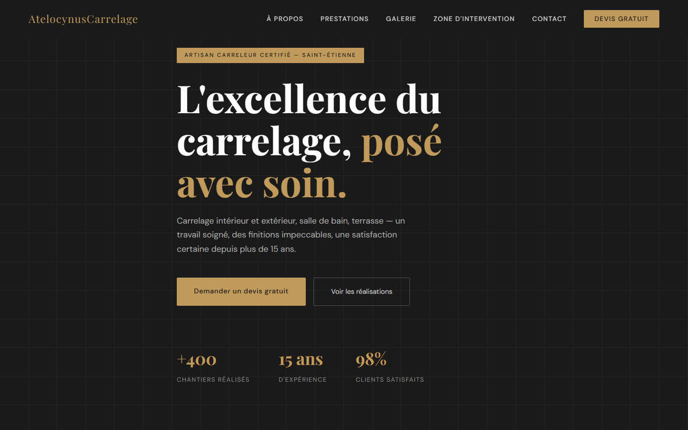
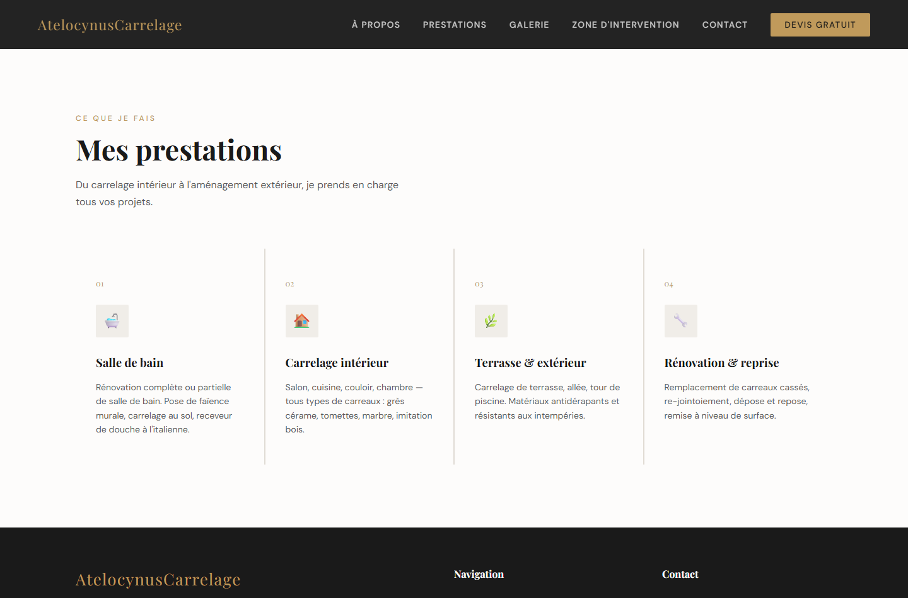
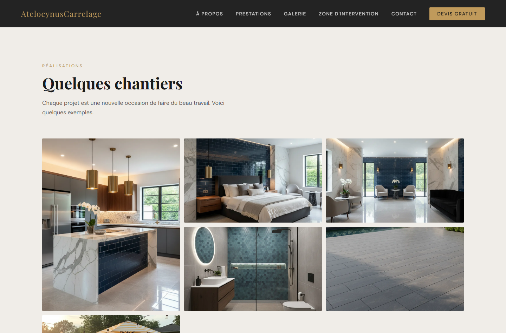
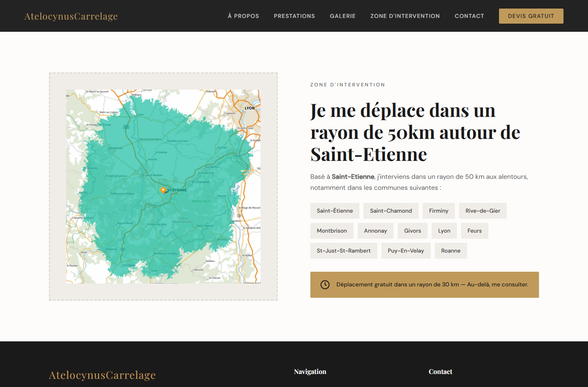
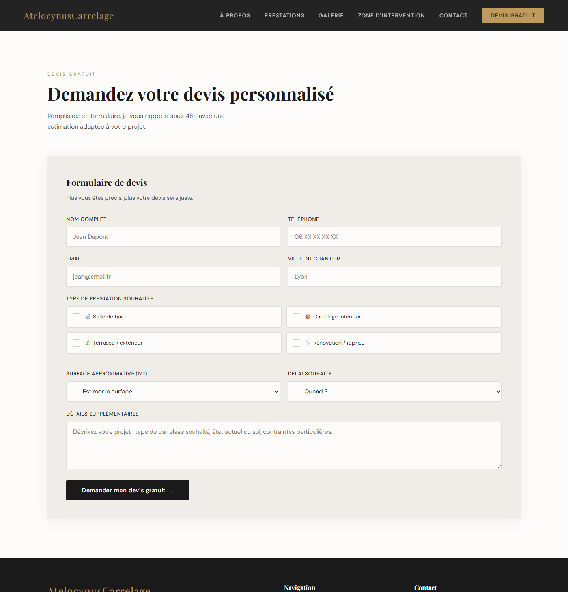
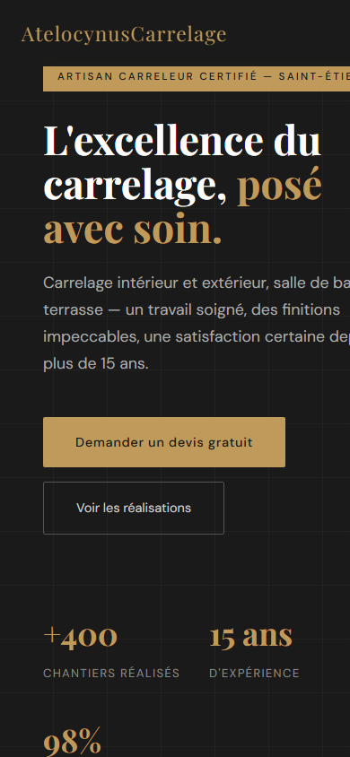

# Showcase Website for a Tile Layer (fictional demo)

> **A one-page website for a tile layer based in Saint-Etienne. The craftsman, his texts, his reviews and his figures are fictional. I built it as a realistic client project: a professional presence and a way to receive quote requests.**

---

## Vision & Purposes

- **Treat it like a real client brief:** a self-employed craftsman who needs to show his work and his area, and let people ask for a quote.
- **Simple and cheap to keep alive:** no database, no CMS, no monthly server. The site is static files that can be hosted almost anywhere.
- **Skill Acquisition:** building a complete deliverable from the first idea to a finished page.

---

## Preview

Hero section:

Services:

Gallery:

Service area:

Quote form:

Mobile:

---

## The Technical Core (Tech Stack)

- **HTML5 and CSS3, no framework.** One `index.html` (about 19 KB) and one `style.css` (about 18 KB).
- **Design:** CSS variables for the palette (black, grey, gold), Playfair Display for titles and DM Sans for text, loaded from Google Fonts. Responsive layout with a media query for small screens.
- **Images:** every picture exists in **WebP** (a lighter image format), and the gallery uses `loading="lazy"` so an image loads only when it gets close to the screen.
- **Contact and quote forms:** the **Web3Forms** service. The form sends a POST request to their API, which forwards the message by mail. This avoids writing a backend.

Page structure: navigation, hero with key figures, about, services (bathroom, indoor, terrace, renovation), gallery, customer reviews, service area with a map and a list of towns, contact form, quote form.

---

## Problems Encountered

- **A form without a server.** A static site cannot send mail by itself. Web3Forms solved it, at the cost of depending on a third-party service. Its access key is visible in the page source, which is normal for this service but it should be restricted to the site domain.
- **Image weight.** The PNG originals were heavy for a phone connection. Converting to WebP and lazy loading fixed it.
- **Writing for a customer, not for developers.** The texts, the 50 km area and the free-travel rule (30 km) had to be clear to someone who only wants to know "can he come to my house and how much".

---

## Skills Learned

- Semantic HTML and CSS without a framework
- Responsive design and image optimization (WebP, lazy loading)
- Using a form-to-mail API instead of building a backend
- Local SEO basics: title, alt texts, area and services written the way customers search
- Thinking from the client's side: what a visitor must find in the first five seconds
